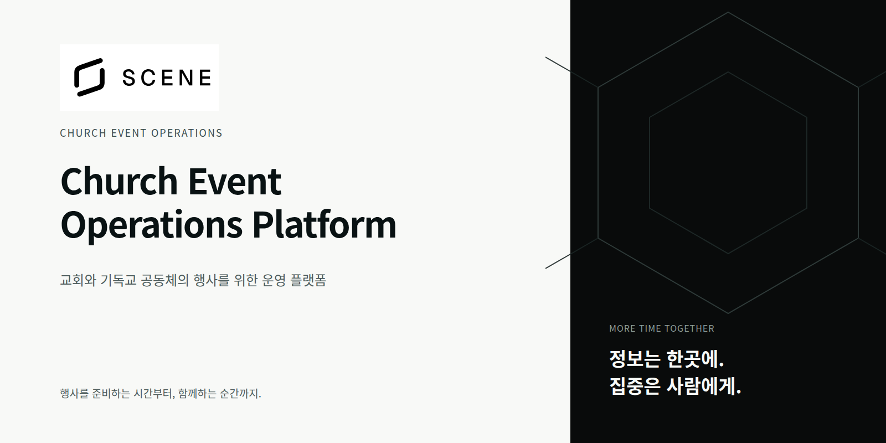

  

  <strong>행사에 필요한 정보는 한곳에. 사람에게 집중할 시간은 더 많이.</strong>

  SCENE은 교회와 기독교 공동체의 행사 준비부터 현장 운영, 
  마무리까지 이어지는 흐름을 돕는 행사 운영 플랫폼을 목표로 합니다.

  <a href="docs/product/PRODUCT_DEFINITION.md">제품 소개</a> &nbsp; · &nbsp;
  <a href="https://www.figma.com/design/RreFdEVMiwgHrV7teaCEOm/?node-id=4-2">디자인 둘러보기</a> &nbsp; · &nbsp;
  <a href="docs/README.md">프로젝트 문서</a>

---

### 함께 준비하고, 함께 움직일 수 있도록

신청 명단은 스프레드시트에, 변경 공지는 단체 대화방에, 현장 사정은 담당자의 기억에.
SCENE은 흩어진 정보를 확인하고 다시 전달하는 수고를 줄여, 준비하는 사람과 참여하는 사람이 필요한 순간에 필요한 정보를 찾을 수 있는 경험을 지향합니다.

| 준비하는 사람에게 | 현장을 맡은 사람에게 | 참여하는 사람에게 |
| :--- | :--- | :--- |
| 행사 정보와 준비 상황을 함께 살펴볼 수 있도록 | 바뀐 상황을 확인하고 다음 행동을 이어갈 수 있도록 | 일정과 안내를 필요한 순간에 찾을 수 있도록 |

### 행사의 크기보다, 실제로 필요한 일에 맞춰

수련회, 아웃리치, 비전트립, 성경학교, 리더십 모임.
행사마다 다른 준비와 운영을 이해하고, 필요한 만큼 자연스럽게 깊어지는 경험을 추구합니다.

 

  <strong>반복되는 운영은 시스템이, 새로운 행사는 사람이.</strong> 
  SCENE · Church Event Operations Platform

